# Annotation on Functional Programming (with Scala) 

John A. De Goes가 정리한 Applied-FP-with-Scala.md 를 참고하여, 함수형 프로그래밍에 대한 개괄적 정리를 몇차례에 나누어서 해보려 한다.
[https://gist.github.com/jdegoes/97459c0045f373f4eaf126998d8f65dc]

# Intro to Functional Programming ( FP )

Software를 구성하는 핵심요소는 결국 `function`과 `Data Structure`들의 조합이다.  
Functional Programming은 수학적 의미의 함수( 같은 입력에 대해서 항상 같은 결과 1개를 내어 놓는다;  `pure function` 이라고 부름)를 극단적으로 추구하는 개발패러다임이다.

> 통상 프로그램에서 `함수`는 상황에 따라 다른 결과를 내거나, 실패하기도 하므로 `순수함수`가 아닌 경우가 많다.
> 함수형 프로그래밍에서는 반드시 `순수함수`로만 software를 개발한다는 점이 다르다.


`순수함수`(이하에서는 단순히 `함수`라고 하겠음)들로만 개발하므로,
1. `함수`를 용이하게 제작하고 다루는 여러 기법들이 존재하고 ( ex: Lambda function, ...)
2. 함수의 유형을 다루기 위한 여러가지 `타입`들이 존재하며, ( ex: Higher order type )
3. `함수`들을 다양한 방식으로 `조합`하는 기법들과 ( ex: Higher order function, ... )
4. 함수의 `조합`을 다루는 다양한 패턴들이 존재한다. ( ex: Functor, Applicative, Monad ...)

> `함수형 언어`의 이러한 독특한 지점은 일반적인 언어와 극명하게 차이나는 부분.

함수형 프로그래밍을 이용한 소프트웨어의 특성
> 1. 극단적인 robustness 제공 
> 2. 엄청나게 간결한 코드 
> 3. 뛰어난 예외안정성, 확장성

함수형 프로그래밍에 대한 공격
> 1. 성능 overhead : 하나의 layer가 추가된 셈이므로 ( 최적화 기법이 있음)
> 2. 가파른 학습곡선

이하에서는 `함수`와 `타입`에 대해 살펴본다.

----
# 1. functions

## function

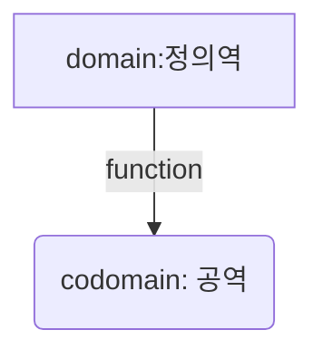

함수형 프로그래밍에서의 함수는 수학적 의미의 함수와 같다.
이를 강조하기 위해 `pure function`이라고 하며, 이하에 함수는 모두 `pure function`을 말한다.


> A (`pure`) function is a mapping from one set, called a `domain` to another set, called the `codomain`.
> In Scala, both `domain` and `codomain` are `types`.

```scala
val square : Int => Int = x => x * x    // x => x * x is lambda.
square(2) // 4
```

`함수 instance`를 생성하고, 변수에 선언할 수 있다. 
- `labmbda function`은 익명으로 정의한 함수 instance를 말한다.   
- 함수를 변수처럼 다룰 수 있어야 하므로, 함수형 언어에는 `lambda function`을 지원하는 문법이 반드시 존재한다.

> 이런 특성을 강조할 때, 함수를 `1급 객체`로 다룬다고 표현한다.  
> lambda 문법이 있고, function instance를 변수처럼 다룰 수 있다는 뜻이다.

---

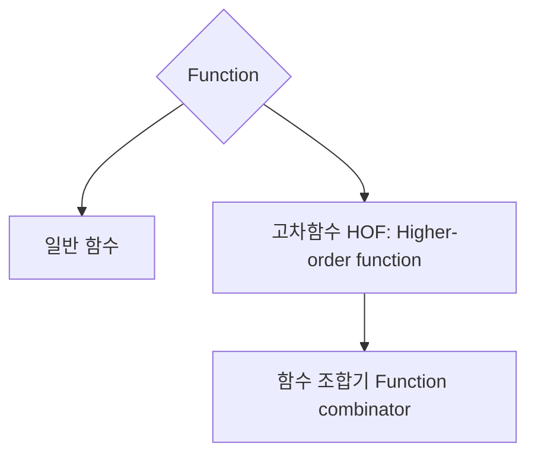
## Higher-Order Functions ( 고차함수; HOF )

함수를 `1급 객체`로 다루기 때문에, 어떤 함수가 인자 또는 반환값으로 function instance를 받을 수 있고,
이런 함수를 통상의 함수와 구분하기 위해 `고차함수`( `Higher-order function`)이라고 한다.

> A __higher-order__ function is a function that *accepts* __or__ *returns* a function.

```scala
trait List[A] {
  def filter(f: A => Boolean): List[A]
}
```

*예*
`List[A].filter`는 `A => Boolean` 함수를 인자로 받고   
`List[A]` 값을 반환하는 함수인데, 인자가 함수이므로 고차 함수이다.

## Combinators (조합기)

고차함수의 특수한 형태로, 함수를 인자로 받아서 함수를 반환할 수 도 있는데,
이런 함수를 `function combinator`(`함수 조함기`)라고 한다.

> __Function__ combinators are higher-order functions that accept __and__ return functions.  
> __Monad__ combinators are higher-order functions that accept __and__ return `Monad`.
> ( Monad는 나중에 다룬다.)

```scala
type Conf[A] = ConfigReader => A

def string(name: String): Conf[String] = _.readString(name)

def both(left: Conf[A], right: Conf[B]): Conf[(A, B)] = c => (left(c), right(c))
```
`both`는 두 개의 함수를 받고, 하나의 함수를 반환하는 고차함수인데, 
인자와 반환값 모두 함수이므로 `combinator`이다.

---

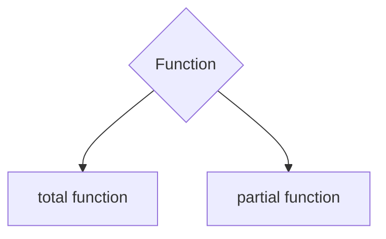
### Partial function

정의역의 일부에 대해서 정의된 함수를 `partial function`이라고 한다.

```scala
// 0이 아닌 Int에 대해 정의된 함수이다.
val divide: PartialFunction[Int, Int] = {
  case x if x != 0 => 100 / x
}
```

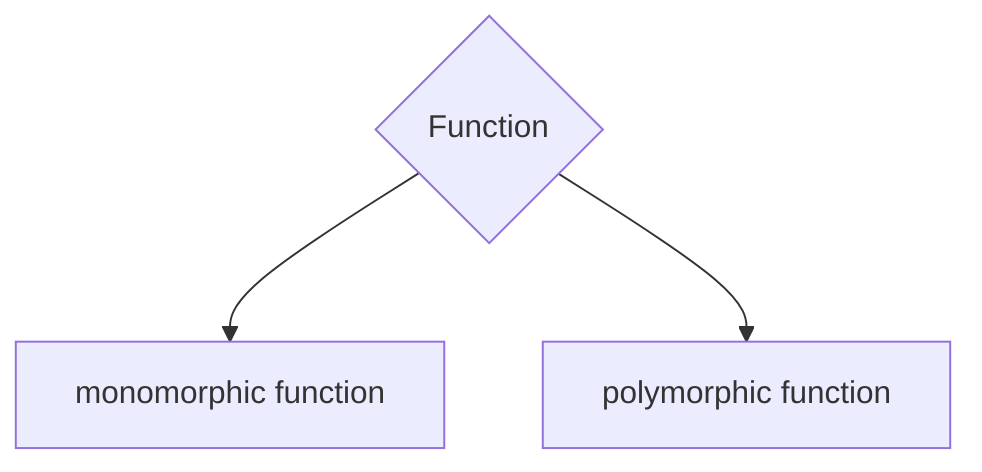
### polymorphic function

타입(들)을 인자로 받아서 정의되는 함수를 말한다.

C++, Java 등에서는 `generic function` 또는 `generic`이라고 부른다.  
`generic`이라는 표현이 더 많이 사용되니, 그것을 쓰도록 하자.

일반함수를 `monomporhpic function` (specific-typed function, concrete function)이라고 할 수 있는데
실무에서는 굳이 이 용어를 쓸일이 없다.

> C++, Java 등에서 `polymorphic`은 특정 타입의 sub-type별로 다르게 동작하는 함수를 말함.  
> 참고: 함수형 프로그래밍언어에서 OOP의 polymorphic은 `type class`로 구현된다.

> **note**  
> generic은 함수형 언어의 근간 문법이기 때문에, 간결하고 사용하기 쉬운 문법이 제공되어야 한다.  
> generic문법이 복잡하다면, 해당 언어가 함수형 프로그래밍 패러다임을 잘 지원하지 않는다고 볼 수도 있다.

```scala
case object identity {
  def apply[A](value: A): A = value
}
identity(3)   // 3
identity("3") // "3"
```

> A polymorphic function is one that is `universally quantified` over one or more type parameters.

`universally quantified`은 임의의 type에 대해서라는 뜻.
대비되는 개념을 `existentially quantified`가 있다.

```haskell
# 모든 x에 대해서...             ==> universally quantified
# f(x) -> y인 y 존재하며 ...     ==> existentially quantified
```


**Existential Types**

타입이 숨겨져 있고, 어떤 타입이긴 하지만 알 수 없는 타입을 `existentially quantified type`이라 하는데,
이런 경우에 existential type을 다루는 scala코드의 사례는 아래와 같다.

Every existential type can be encoded as a universal type. This process is called `skolemization`.
```haskell
# `skolemization` : ∃ 기호를 없애고, 함수로 치환 --> 존재하는 y를 capture 하는 방식으로 내포(closure)
#For every x, there exists a y such that P(x, y) 
∀ 𝑥 . ∃ 𝑦 . 𝑃 ( 𝑥 , 𝑦 ) → ∀ 𝑥 . 𝑃 ( 𝑥 , 𝑓 ( 𝑥 ) )
```
https://demonstrations.wolfram.com/Skolemization/

```scala
trait ListMap[A] {
  type B
  val list : List[B]
  val mapf : B => A
  
  def run : List[A] = list.map(mapf)
}
```
*Example*
The type `ListMap[A]#B` is some definite type, but there is no way to know what that type is — it could be anything.  
Existential types are useful for hiding type information that is not globally relevant.  

소프트웨어 개발실무관점에서 알아야 할 것은
1. existential type 문법 :`ListMap[A]#B`에서 B는 ListMap[A]내에 정의된 `existential type`
2. `skolemization`은 종종 `closure`로 구현한다.

*사례*
> free monad를 만들때, 조건을 만족시키는 타입을 `existential`로 처리할 필요가 생기는데,  
> 그때 아래 sample코드와 같은 trick을 사용한다.  

## Evaluation

함수 또는 표현식(expression)을 평가하는 것은 곧 프로그램을 실행하는 것이다.

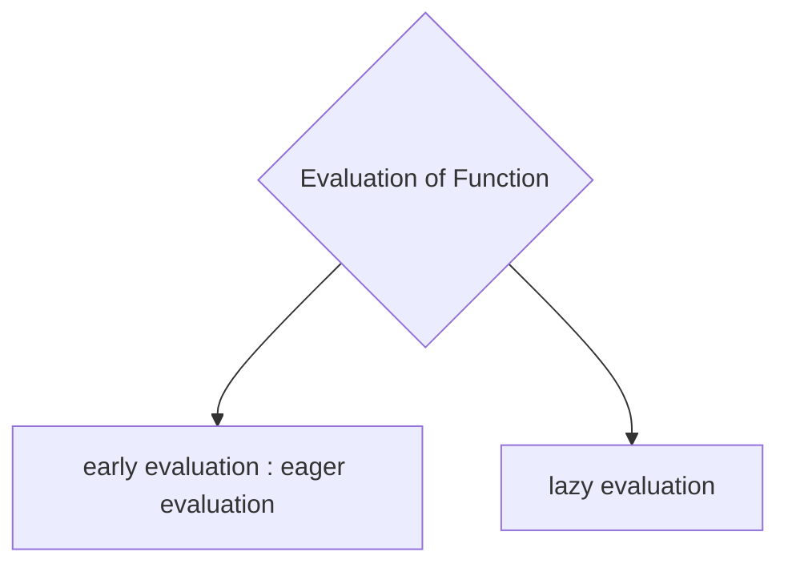
- 평가 결과를 미리 계산하여 동작하도록 만드는 방식이 early evaluation이다.
- 반면, 평가 방법 자체를 전달하고 필요할 때 계산하도록 하는 방식이 lazy evaluation이다.

> 대부분의 프로그래밍 언어는 `early evaluation`을 채택하고 있으며, 
> `lazy evaluation`을 문법 수준에서 제공하지 않는 경우, 
> '값을 얻는 함수 조각(chunk)'을 전달하여 필요할 때 평가하는 방식으로 우회 처리하곤 한다.
> 
> 반면, 대부분의 함수형 언어는 lazy evaluation을 문법 수준에서 지원한다.
> lazy evaluation은 함수형 프로그래밍의 본질적인 요소는 아닐 수 있지만, 종종 그 특징 중 하나로 언급된다.
> 실행순서가 기대와 다르게 나오는 경우도 있으므로 주의가 필요하다.

---

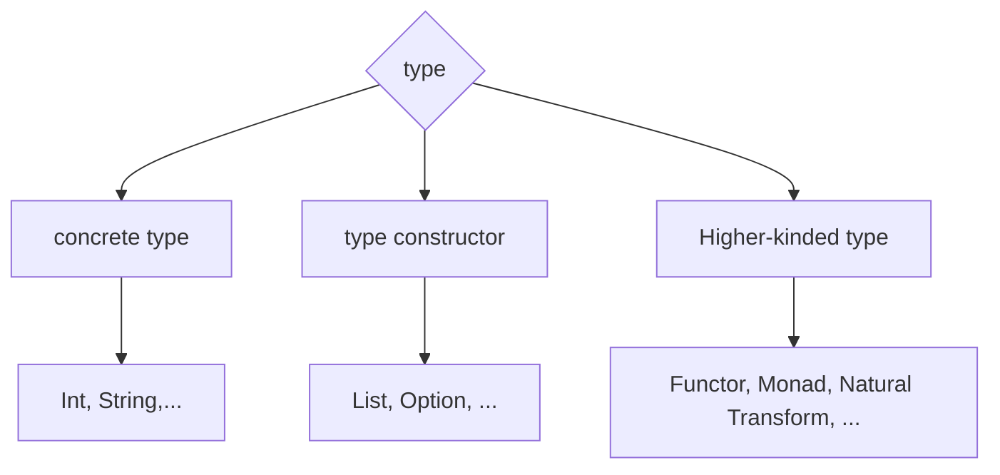

## 1. concrete type (proper type)

보통 Type이라고 하면, `proper type`(또는 `concrete type`)을 의미하는데, 
그것은 instantiate(메모리를 할당해서 생성)할 수 있는 타입을 말한다.  

*concrete type* : Int, String, List[Int], Map[Int, String], ...

**HashMap[Int, String]**
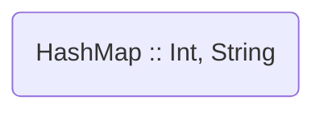

```scala
// scala
val a : List[Int] = List(1,2,3)
val m : HashMap[Int, String] = HashMap( 1 -> "One", 2 -> "Two")
```

## 2. type constructor

반면, 
예를 들어, List[?]는 단독으로 instantiate 할 수 없고,
반드시 어떤 것(예를 들면 Int)에 대한 List 인지 주어질 때만 instantiate 할 수 있다.

이렇게 concrete type(Int)이 주어질 때, concrete type(List[Int])을 만들 수 있는 type(List)을 
`type constructor` 라고 한다.

즉, 인자와 반환값이 모두 `contrete type`이며,
`concrete type`(들)을 받아서 `concrete type`을 만드는 함수라고 생각할 수 있다.

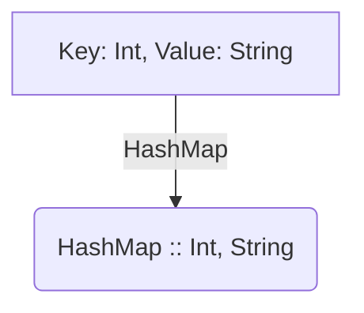

```scala
// scala
val a : List= ???  // compile error
```

**type constructor**

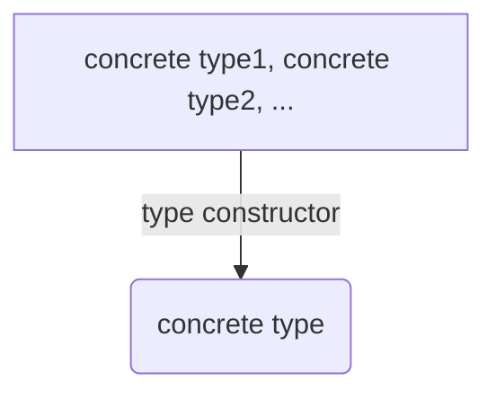

## 3. higher-kinded type ( HKT )

한번 더 나가서 생각해 보면, 인자 또는 반환값이 `type constructor` 인 경우도 생각해 볼 수 있는데,
이것을 `Higher-kinded type`(고차타입, 또는 `Higher-order type`)이라고 한다.

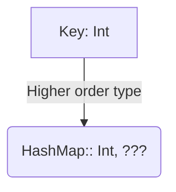

`HashMap:: Int, ???`는 `type constructor`로서, value의 (`concrete`)타입이 String으로 주어지면
`HashMap:: Int, String`을 만든다.

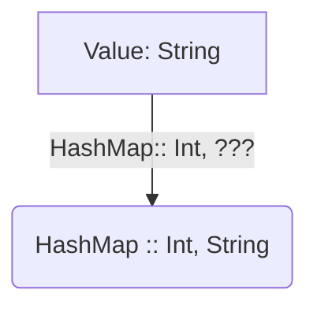

## 4. Summary :: (concrete) Type, Type Constructor, Higher-Order Type

넓은 의미의 `type`은 다음과 같이 분류할 수 있다.

1. **Concrete type (Proper type)**
  - 실제 값(instances)을 가질 수 있는 타입.
  - 예: `Int`, `String`, `List[Int]`
  - 단독으로 instantiate 가능하다.
  - 좁은 의미에서 `type`은 `concrete type`

2. **Type constructor**
  - type(들)을 받아서 새로운 `type`(보통은 `concrete type`)을 만듬
  - 예: `List`, `Option`, `Either`
  - `type constructor`가 아래의 `higher-kinded type`을 포함하는 의미로 쓰기이고 함.

3. **Higher-kinded type(Higher-order type)**
  - 인자 또는 반환값에 type constructor가 포함
  - 예: `Functor[F[_]]`, `Monad[M[_]]`
  - `concrete type`과 대비되는 용어로 `type constructor`와 `higher-kinded type`를 혼용하기도 함.

## 5. Kind

- `kind`는 **타입의 타입**을 나타낸다.
- `type`을 "형식(signature)" 으로 구분하는 개념
- `kind`를 통해 타입이 몇 개의 concrete type이나 type constructor를 받아서 새로운 타입을 생성하는지 표현할 수 있음

| Kind                   | desc                                        | example                      |
|------------------------|---------------------------------------------|------------------------------|
| `*`                    | concrete type                               | `Int`, `String`, `List[Int]` |
| `* -> *`               | type constructor ( unary type constructor)  | `List`, `Option`             |
| `(*, *) -> *`          | type constructor ( binary type constructor) | `Either`, `Tuple2`           |
| `(* -> *) -> *`        | higher-kinded type                          | `Functor[F[_]]`              |
| `(* -> *) -> (* -> *)` | higher-kinded type                          | `Compose[F[_], G[_]]`        |
| `*-> * -> *`           | higher-kinded type                          | curried `HashMap`            |
| `* -> (* -> *)`        | higher-kinded type or type constructor      | `List`, `Option`             |


- Type은 크게 **concrete type**, **type constructor**, **higher-kinded type**으로 나뉜다.
- Type constructor는 **인자로 받는 concrete type의 개수**에 따라 다양한 형태가 존재한다.
- Higher-kinded type은 **type constructor를 인자로 받거나 반환**하는 type이다.
- Kind를 통해 고차타입 또는 타입생성자를 분류할 수 있다.

> `* -> ( * -> *)`
> `(* -> *)`(type constructor)를 반환하므로 higher-kinded type인데,
> 반환타입이 `(* -> *)`(type constructor)인 타입생성자로 부를 수도 있다.
> 현업개발에서 두 용어의 구분실익은 적으며, 혼용하여 사용되니 업밀한 구분에 신경쓸 필요는 없다.

### Insight of kind

> **`kind`라는 개념이 필요한 이유**  
> `kind`는 단순히 타입을 분류하는 것이 아니라,
> **generic 타입 위에 고차 추상화를 안전하게 구축하기 위한 메타 구조**의 역할을 한다.

1. 고차 타입 지원
   - Functor, Monad 같은 타입 클래스는 List, Option, Either처럼 타입 생성자에 대해 정의됨.
   - ex) Functor는 `* → *` kind를 요구하므로, List는 가능하지만 Int는 불가능
   - kind를 통해 `type class`가 어떤 `type constructor`에 적용 가능한지 판단할 수 있음.
   - `type class`는 다음 절 참고

2. 타입 추론과 컴파일러 검증
   - 컴파일러는 kind 정보를 통해 타입 인자가 올바르게 사용되었는지 검증 
   - Haskell에서는 프로그램의 특정성질을 컴파일타임에 증명 하는 기능이 따로 있다.!!!

3. Generic 프로그래밍에서의 안정성
   - kind는 타입 매개변수의 구조를 명확히 하여 generic 함수나 타입을 정의할 때 타입 안정성을 보장 
   - ex: map :: Functor[F[_]]에서 F는 반드시 `* → *` kind여야 함.

## 6. Type Class

`type class`는 어떤 특정 `type`(`higher-kinded type`이나 `type constructor`를 염두에 두어야 한다)에 대해 
동작하는 인터페이스 또는 제약조건 이다.

```scala
// type class in scala
/*
  type class 정의
*/
trait Show[A] {
  def show(a: A): String
}

/*
  type class를 만족시키는 type class 인스턴스들
  필요한만큼 계속 추가하면 된다.
*/
implicit val intShow: Show[Int]
= new Show[Int] { def show(a: Int): String = s"Int($a)" }

implicit val stringShow: Show[String]
= new Show[String] { def show(a: String): String = s"String('$a')" }

/* 
  type class를 사용하는 코드
  (implicit sh: Show[A]) 
  A라는 타입에 대해서 Show라는 type class가 존재해야 한다는 뜻.
*/
def printShow[A](a: A)(implicit sh: Show[A]): Unit = {
  println(sh.show(a))
}
```

위의 샘플은 `concrete type`에 대한 `type class`이므로 OOP의 상속을 쓰는 것과 큰 차이 없는 것으로 보인다.

```scala
// * -> *  타입에 대한 type class
trait Functor[F[_]] {
  def map[A, B](fa: F[A])(f: A => B): F[B]
}

// * -> *  타입인 List에 대한 type class 인스턴스
implicit val listFunctor: Functor[List] = new Functor[List] {
  def map[A, B](fa: List[A])(f: A => B): List[B] = fa.map(f)
}

// type class 를 사용하는 코드
def convert[F[_], A, B](f: A => B)(implicit functor: Functor[F]): F[A] => F[B] =
  fa => functor.map(fa)(f)

val converted: List[Int] => List[String] = convert((x: Int) => s"Number: $x")
val result = converted(List(1, 2, 3))

```

단순한 타입이 아닌 고차타입(List, Option 등)에 대해 인터페이스를 정의하고,    
이를 암묵적으로 주입받아 일반화된 함수에서 사용한 것이다.

> note : `type class`는 함수형 언어에서 거의 빠짐없이 등장한다.

## 6. ADT ( Algebraic Data Type)

대수적 타입(`ADT`)은 타입과 타입에 정의된 연산의 묶음으로 구성된다.
앞서 살펴본 모든 `type`들은 일종의 `ADT`로 볼 수 있다.

> 예를 들어, `정수 Monoid`는 어떤 연산(ex: 덧셈)에 닫힌 정수의 집합으로 정의된다.

타입들을 조합하여 새로운 `ADT`를 생성하는 두가지 방법을 살펴본다.

### Product Type

곱타입(`prodcut type`)은 여러 타입들을 *Cartesian cross product*으로 조합하여 만든 타입.

> Product types are defined by a *Cartesian cross product* on 2 or more types.

```scala
type Point2D = (Int, Int)
```
*Example*: 2차윈의 점은 (x, y) 즉, 두개의 숫자로 만든 `product type`이다.

#### Case Classes
`product type`을 만드는 문법은 거의 모든 언어에 있다.  
구조체, class, 튜플 등을 이용하여 `product type`을 만들 수 있다.   
scala의 `case class문법`은 `product type`제작 전용 문법이라고 볼 수 도 있다.

> In Scala, case classes are the idiomatic representation of product types. The terms of a case class are identified by *name*.

```scala
case class Person(name: String, age: Int)
```
*Example*: Person는 `name` **과(and)**  `age`를 갖는다. (반드시 둘다 가짐.)


### Sum Types ( co-product type)

합타입(`Sum Type` ( `co-product type`)은 여러 타입들을 *disjoint union*으로 조합하여 만든 타입이다.

> Sum types are defined by a *disjoint union* on 2 or more types.

```scala
type RequestResult = Either[Error, HttpResponse]
```
*Example*: RequestResult는 `Error` **또는(or)**  `HttpResponse`를 갖는다. (둘다 동시에 갖지 않음)

#### Sealed Traits

`sealed trait`은 scala에서 `sum type`을 만드는 문법이다.
> note: `sum type`작성방법을 문법수준에서 제공하지 않는 프로그램 언어들이 생각보다 많다.


```scala
sealed trait AddressType
case object Home     extends AddressType
case object Business extends AddressType
```
*Example*: `AddressType`은 `Home` **또는** `Business`이다.
